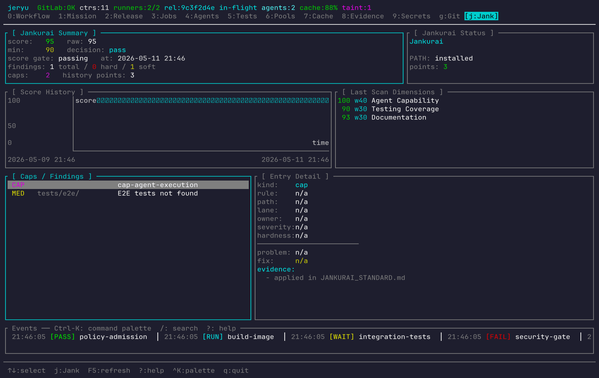

<p align="center">
  
</p>

<div align="left">
  <p>
    <a href="agent/repo-score.md">
      
    </a>
  </p>
  <h3>The Git-Compatible Version Control Layer for the AI Era</h3>
</div>

---

**Git should remain familiar. Agent work should become accountable.**

`JeRyu` is a single-binary Rust control plane that wraps Git first, then adds agent-aware CI/CD tooling, smart test selection, runner orchestration, and remote server management. It is designed to be the foundational layer where autonomous software work meets deterministic human governance.

[**Read the Full Mission**](docs/MISSION.md) | [**Installation Guide**](docs/INSTALL.md)

---

## 🚀 Mission Control in Your Terminal

JeRyu isn't just a headless orchestrator. It comes with a blazing-fast, proof-rich Terminal UI that serves as your mission control for agent activity.



Visualize live pipeline execution, monitor remote runner pools, inspect test bottlenecks, and review agent capabilities—all in one place without digging through raw, disconnected logs.

---

## 🛑 The Problem: Flaky, Unaccountable Automation

Modern CI pipelines and selective testing are brittle. When autonomous agents start writing code, traditional CI struggles:
- **Obsolete Work:** Superseded pipelines keep running after newer agent commits make them irrelevant.
- **Opaque Evidence:** Logs rarely explain *why* work ran, skipped, or failed.
- **Ambient Authority:** Approval, secrets, and credentials were designed for humans, not scoped agents.
- **Wasted Time:** Flaky tests and monolithic test runs waste precious compute and local agent time.

## 🟢 The JeRyu Solution

JeRyu bridges the gap between public developer pain and agent-native version control. 

- **Git-Compatible:** Existing remotes (`origin`) survive installation. Muscle memory stays intact. 
- **Agent-Native:** Captures and governs every agent action, providing structured evidence for everything.
- **Risk & Confidence Gates:** Enforces least-privilege policy for deploys, remote access, and destructive actions.
- **Explainable Testing:** Skips unnecessary local tests conservatively using deterministic impact graphs and proof receipts.

---

## ✨ Core Capabilities

### 1. Agent-Native Git Wrapper
Intercepts and records agent Git commands into durable local state. Future actions are attributable, recoverable, and perfectly synced with the JeRyu state engine.

### 2. VTI & Smart Test Selection
Maps your changes to the smallest conservative validation plan. Uses SmartCache and distributed runners so your agents avoid wasting time on unnecessary work, without sacrificing trust.

### 3. Zero-Friction Remote Provisioning
Need a bigger machine for your agents? Point JeRyu at a Linux host over SSH and get a fully configured remote execution surface instantly—without turning setup into an infrastructure project.

### 4. Seamless MCP Integration
Operate via CLI, TUI, or the **Model Context Protocol (MCP)**. All surfaces share the same exact policy model, grants, evidence records, and action registry, ensuring that agents and humans play by the same rules.

---

## 🛠️ Getting Started

JeRyu stays in user space by default and won't touch your shell startup files without permission.

### Local Install (Day 1)

Install JeRyu locally and safely wrap your Git workflows:

```bash
git clone https://github.com/jeppsontaylor/JeRyu.git
cd JeRyu

# Install safely in user-space
cargo run -p jeryu -- install --yes

# See what the installer would do without making changes
cargo run -p jeryu -- install --dry-run --yes --prefix ~/.jeryu/bin
```

### Remote Provisioning (Day 2)

Provision a Linux host seamlessly over SSH to act as a runner or agent enclave:

```bash
cargo run -p jeryu -- remote install my-server --alias my-server --setup-key --yes
```
*This provisions a dedicated SSH key, verifies dependencies, and enables the remote user unit.*

Monitor your remote nodes:
```bash
cargo run -p jeryu -- remote status my-server
cargo run -p jeryu -- remote logs my-server
```

---

## 🏗️ Architecture & Principles

- **Rust-First**: State transitions, orchestration, and policy are written in strongly-typed, memory-safe Rust. Shell scripts are avoided where possible.
- **Local-First, Distributed-Ready**: A laptop is enough to start. When you need it, remote runners integrate naturally.
- **Evidence Over Logs**: We prioritize structured evidence capsules over raw text logs, so agents can parse, diagnose, and recover from failures autonomously.

> *If a feature makes the system faster but harder to explain, govern, recover, or trust, it is the wrong optimization.*

---

## 🔍 Validation & Troubleshooting

JeRyu is deeply inspectable. You can always run local doctor checks to verify system health:

```bash
cargo run -p jeryu -- install doctor --json
cargo run -p jeryu -- install smoke --dry-run
```

For full documentation on troubleshooting and advanced configuration, see our [Installation Guide](docs/INSTALL.md).
